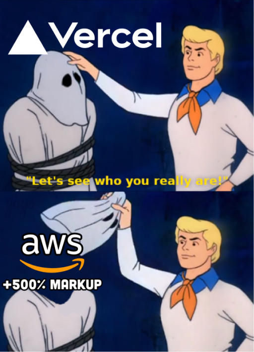
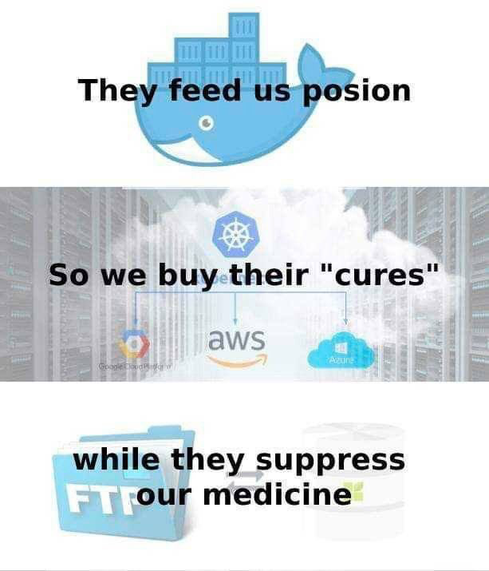
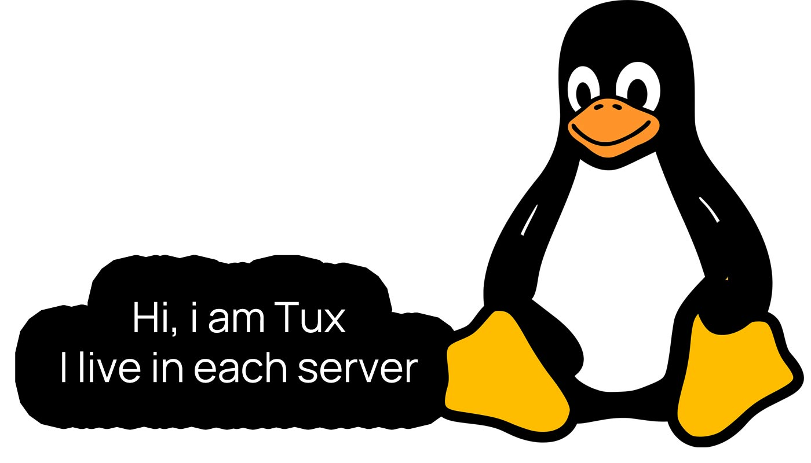
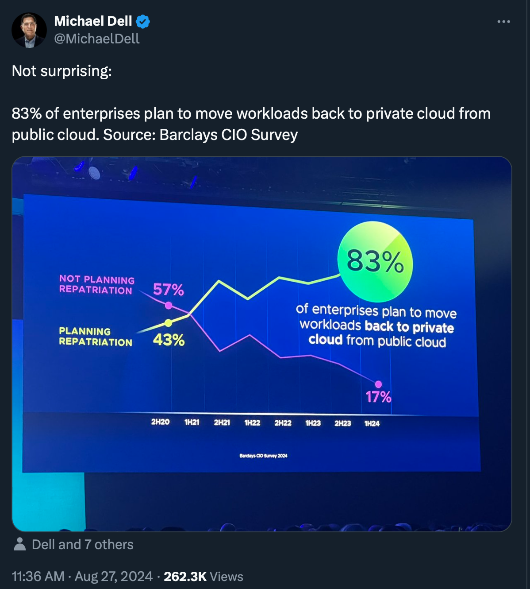
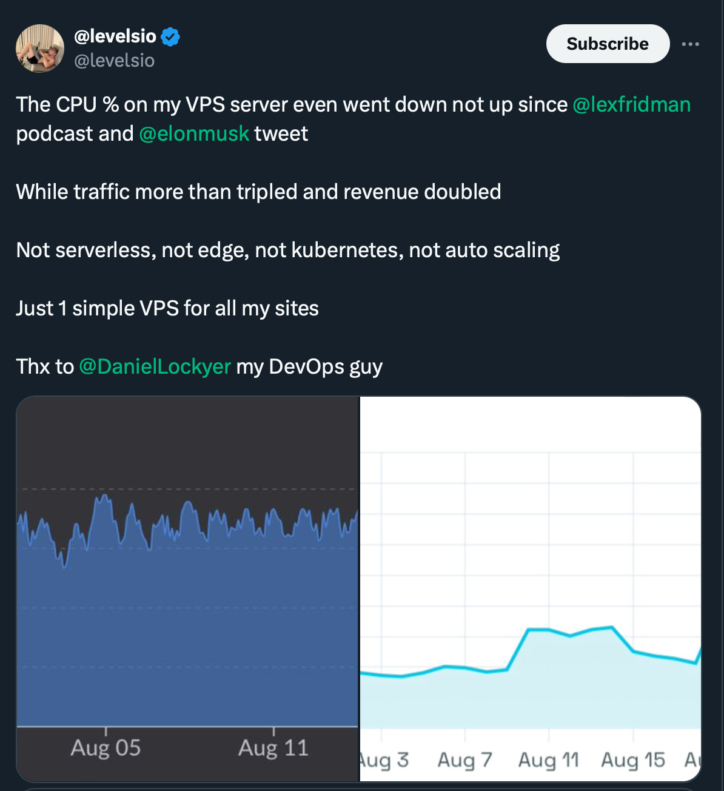

+++
title="Como hostear lo que quieras en la nube"
date=2024-09-02
+++

Llega un punto en el que cualquiera que se esté introduciendo al mundo del desarrollo de software necesita hostear algo en la nube. Ya sea una simple página web estática, un api o base de datos; inevitablemente nuestro querido localhost deja de ser suficiente y comenzamos a buscar cómo publicar y compartir nuestros proyectos con los demás, ya sean humanos o scrappers que se encargan de alimentar al siguiente gran LLM de turno. En esta entrada, busco mencionar distintas maneras que tenemos para hostear nuestros proyectos en la web y, finalmente, comentar lo que considero es la mejor manera para hacerlo. 

# Páginas estáticas

No toda web necesita ser construida usando el último framework de JavaScript que ha salido al mercado. Muchas veces nos basta con hacer uso de HTML y algo de CSS, aunque hay quienes dirían que [esto último ni siquiera es necesario](https://motherfuckingwebsite.com/). En cualquier caso, [Github Pages](https://pages.github.com) probablemente sea la opción más conocida para hostear este tipo de páginas. Basta con entrar a la configuración del repositorio y en unos pocos minutos ya contaremos con una url para que el mundo pueda conocer nuestra increíble web. Tenemos incluso la opción de usar un dominio propio, en caso no queramos tener el *.github.io* en nuestro enlace. 

Si el confiable combo de HTML y CSS no son suficientes, también es posible deployar aplicaciones [desarrolladas con NextJS](https://www.freecodecamp.org/news/how-to-deploy-next-js-app-to-github-pages/)  o webs hechas usando distintos static site generators como [Hugo](https://medium.com/@magstherdev/github-pages-hugo-86ae6bcbadd) o [Zola](https://www.getzola.org/documentation/deployment/github-pages/) (de hecho, este blog está construido usando este último).

# Páginas dinámicas
Sea cual sea el framework de JavaScript que estemos usando, lo más probable es que haya alguna plataforma que nos permita conectar nuestro repositorio con ella y tener deploys instantáneos cada vez que hacemos un pusheo. Vercel quizás sea la más conocida, pero también existen otras alternativas como Fly.io o Netlify. En cualquier caso, al usar un SaaS siempre es importante estar atento y limitar los recursos -dentro de lo posible- que vayamos a usar para no [terminar endeudados en el caso nuestra idea millonaria tenga éxito y pasemos a tener un gran tráfico de un día para el otro.](https://www.infoq.com/news/2024/06/vercel-serverless-scale-expenses/)

# API’s o bases de datos
Igual que con las páginas dinámicas, existen una gran cantidad de plataformas que nos permiten deployar apis hechas con distintos lenguajes y frameworks, o bases de datos de todo tipo. En su momento era un gran fan de [Heroku](https://www.heroku.com/home), sin embargo, ante la [muerte de su tier gratuito](https://www.heroku.com/pricing), he probado otras alternativas como [Render](https://render.com) o [Fly.io](https://fly.io) sin tener ninguna queja de gravedad. El único inconveniente que he podido experimentar al hacer uso de los servicios gratuitos de dichas plataformas son los **timeouts** que se generan si el servicio web deja de recibir tráfico después de un tiempo determinado. Esto ocasiona que la siguiente petición posterior a ello tarde más de lo esperado, lo cuál puede no ser algo de gravedad en ciertos casos, pero no deja de ser algo molesto. 

# VPS: A - not so- new hope

|  | 
|:--:| 
| *Luke Skywalker en el episodio 4 de Star War titulado, para aquellos que no capten la referencia* |

El concepto de usar un servidor para hostear aplicaciones o servicios no es para nada nuevo. Antes de la llegada de términos como serverless, S3 o EC2, era común para las empresas contar con data centers en sus instalaciones sobre los cuales se montaban todos los servicios que pudiesen necesitar para sacar adelante su producto. Sin embargo, en los últimos 10 o 15 años la tendencia en el desarrollo de software ha sido la de abandonar lo propio y recurrir a plataformas como AWS, GCP o Azure.

No intento negar el gran beneficio que se puede llegar a tener al usar este tipo de servicios. Tener un uptime de 99.9%, escalar infinitamente -o mientras nuestra tarjeta lo aguante- y poder entregar contenido multimedia a cualquier parte del mundo con una latencia mínima son sin duda grandes avances tecnológicos de los que todos gozamos en nuestro día a día. Sin embargo, la realidad es que la gran mayoría de nuestros proyectos podrían vivir tranquilamente en servidores de 2 nucleos y 1gb de ram que corran Linux. 

Son cada vez más aquellos que deciden dejar de lado las nubes públicas y vuelven a las nubes privadas. Actualmente se tienen tantas alternativas -la gran mayoría de ellas open source y gratuitas- a los distintos servicios que ofrecen los gigantes de la nube, que para muchos el tradeoff de mantener un servidor propio empieza a ser cada vez menos relevante.

|  | 
|:--:| 
| *Tweet de David Heinemeier Hansson, creador de Ruby on Rails, sobre el alto costo de usar Datadog* |

|  | 
|:--:| 
| *Tweet de levelsio, un dev famoso y millonario que usa un solo VPS para todos sus productos* |

## Saliendo de nuestra zona de confort
La idea de configurar y usar un servidor Linux por primera vez puede llegar a ser intimidante para alguien que solo ha usado Windows hasta el momento. Sin embargo, creo que el aprender a hacerlo expande enormemente los conocimientos que uno tiene como desarrollador: configurar iptables para abrir puertos, dockerizar servicios y aplicaciones, configurar un reverse proxy como caddy o nginx para poder tener varios servicios en un mismo servidor, configurar DNS records y SSl en Cloudflare para no tener que usar la ip del servidor como url; todo ello son cosas que quizás nunca hubiera aprendido si me mantenia en mi zona de confort usando Netlify y Render para hostear mis proyectos. 

No es ninguna noticia que el mercado de desarrolladores de software se encuentra saturado. Desde hace años se viene vendiendo en redes sociales a nuestra profesión como una manera de hacerse rico de manera sencilla. Además, si bien la posibilidad de trabajar de manera remota es un gran privilegio con el que contamos, esto también abre la posibilidad a que no solo tengamos que competir con otros desarrolladores de nuestro país, sino que también tenemos que enfrentarnos con aquellos de países vecinos e incluso de países con una mano de obra considerablemente más barata, como la India. En ese sentido, y especialmente como alguien con poca o ninguna experiencia, uno necesita encontrar la manera de destacar por sobre los demás. Es así que ser el loquito linuxero que sabe levantar un servidor desde 0 y montar un pipeline de CI/CD puede que sea el factor diferenciador que necesitas.
