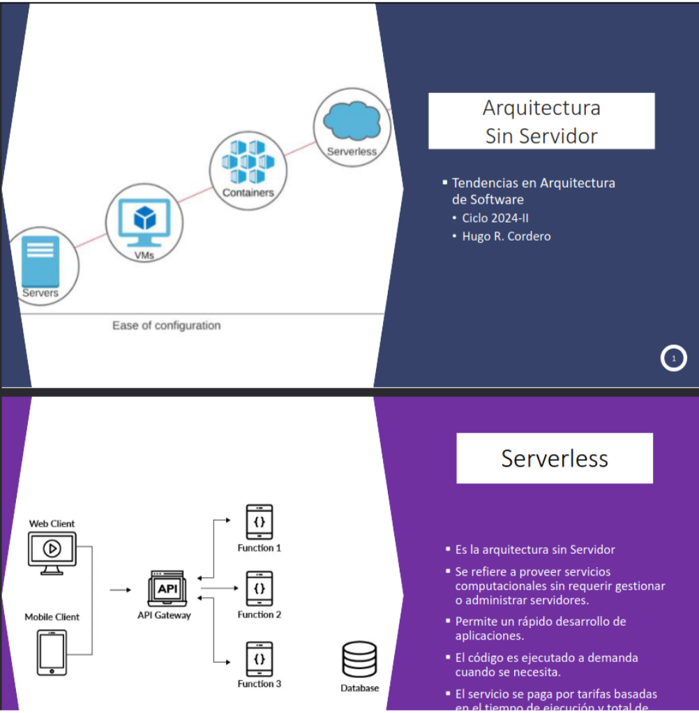

+++
title="La experiencia de estudiar Ingeniería de Software en una universidad pública"
date=2025-02-01
+++

Contrario a lo que tristemente suele ser la norma, tuve el privilegio de poder elegir qué carrera estudiar. Nunca tuve ninguna presión por mis padres para estudiar medicina, derecho o alguna otra carrera socialmente considerada como “buena”. Si bien no puedo decir que siempre tuve la certeza de la carrera que quería seguir -en un inicio también estaba entre mis opciones estudiar mecatrónica o electrónica- ahora sí puedo afirmar que la elección de mi carrera fue la correcta, con ciertos asteriscos que mencionaré más adelante.

La elección de dónde estudiar fue bastante más sencilla. No estaba en las posibilidades de mi familia el pagar una universidad privada, por lo que mis dos opciones eran estudiar Ingeniería de Software en San Marcos o Ciencias de la Computación en la UNI. Luego de asistir a la feria vocacional organizada por la universidad, y de colarme en algunos eventos organizados por mi futura facultad, finalmente decidí escoger a San Marcos como mi alma mater. Puede sonar algo cliché, pero caminar por el campus de la universidad siendo un escolar a punto de acabar el colegio fue algo que realmente me cautivo: las ventas de panchos, tómbolas y otras actividades realizadas por los estudiantes para recaudar fondos; los ensayos de danza o música; los afiches promocionando todo tipo de actividades en distintas facultades; dar vueltas en el mítico burrito, la experiencia de estar en San Marcos es algo que debes vivir para poder entender.

Habiendo pasado más de 5 años desde entonces, y con los 226 créditos requeridos aprobados para egresar de la carrera, hay mucho por contar sobre la experiencia de estudiar Ingeniería de Software en una universidad pública.

# Infraestructura
Quitando algunas excepciones de últimos ciclos, la realidad es que se podrían usar computadoras de oficina para la gran mayoría de cursos prácticos que lo requieran. Durante los 4 primeros años, lo más demandante, computacionalmente hablando, que se hará en clase es mostrar figuras 2D y 3D con OpenGL. En ese sentido, no tiene mucho sentido gastar más de un millón de soles en comprar 140 computadoras, pudiendo comprar más computadoras con especificaciones ligeramente reducidas. Esto ayudaría a evitar que 3 o 4 estudiantes tengan que compartir una sola computadora, situación que se suele dar debido a la gran cantidad de estudiantes matriculados en un curso y salones con 20 computadoras como máximo.

Sin embargo, el problema que tiene mi querida Facultad de Ingeniería de Sistemas e Informática, de ahora en adelante FISI, no es la falta de potencia informática. Irónicamente, el problema es la **falta de software**. No son pocas las veces que un profesor no pudo continuar el lado práctico de la clase porque una computadora no tenía X o Y programa y/o librería. En estos casos, se contactaba a soporte quienes, haciendo uso de los grandes avances en instalación y configuración masiva de software, traían un disco duro lleno de instaladores de dudosa procedencia, con la esperanza de que se tuviese el instalador requerido para la ocasión. En caso no fuese así, se debían esperar 20 o 30 minutos a que se descargara de internet. 

Esta situación es frustrante, no solo porque hoy más que nunca es realmente sencillo instalar software de manera masiva, sino porque es algo que se podría hacer con anticipación, y no en medio de una clase. Los profesores que realmente enseñan su curso -que lamentablemente no son la mayoría- preparan de antemano los temas que se tocarán en clase. Tranquilamente la facultad podría solicitarles un listado de los programas y/o librerías que requerirán para el desarrollo de su curso antes del inicio de clases, evitando este tipo de situaciones.

Así, en la FISI se tienen computadoras con procesadores i9 de 14va generación y tarjetas de video nvidia A4000 que podrían ser usadas para hostear LLM. maquinas virtuales, clusteres de big data o que los estudiantes entrenen modelos de Machine Learning para sus tesis, pero que finalmente son usadas para escribir un Hello World en C++ usando DevC++, un IDE lanzado hace casi 30 años. 

Para cerrar con este punto, hay que hacer una mención honorífica al equipo de redes y telecomunicaciones, internet de las cosas e incluso un datacenter con el que la facultad cuenta, pero que básicamente ningún estudiante usa durante el desarrollo de su carrera.

# Calidad docente
Antes de continuar con este punto, quiero mencionar que durante todos los ciclos he estado en los primeros turnos de matrícula. Esto quiere decir que siempre he podido elegir con qué profesor llevar cada curso, por lo que nunca estuve en la situación en la que debía matricularme con el “peor profesor” por falta de cupos.

Esto es algo sobre lo cual he discutido mucho con compañeros de la carrera y de lo cual tranquilamente se podría escribir otro post al respecto. Personalmente, creo que el principal problema que se tiene con el cuerpo docente de la facultad, fuera de la falta de conocimientos o experiencia que se pueda llegar a tener, es la falta de ética profesional y compromiso como profesor. Para ilustrar esto, voy a listar algunas de las situaciones que he vivido durante la carrera.
He tenido profesores que:
- Daban clases virtuales conduciendo 
- Enseñaban durante 45 o 60 minutos y luego se desconectaban, cuando la clase debía durar 4 horas
- Usaban un sílabo y ppts de hace más de 10 años.
- Se quedaban dormidos en medio de la clase
- Llegaban entre 1 a 2 horas tarde a clases
- Ponían grabaciones de ciclos pasados en lugar de enseñar la clase.
- “Perdían” las notas del curso y luego compartían un Excel para que cada estudiante ponga la nota que consideraba merecer
- Solo realizaban clases durante la primera semana del ciclo. Las 15 siguientes eran exposiciones de los alumnos (sin ningún tipo de feedback, comentario adicional o discusión por parte del profesor)
- Tomaban el examen final mientras llevaban a su hijo al cine (se escuchaba en la llamada como el niño comentaba qué película quería ver)
- Usaban el examen de otra universidad como examen parcial .
- Pedían que durante el curso se escribieran y publicasen artículos científicos, obviamente poniendo al profesor como coautor a pesar de no haber escrito una sola línea de dicho artículo
- Ponían notas aleatorias entre 11 y 14 a todos los estudiantes del curso.

|  | 
|:--:| 
| *Examen parcial de otra universidad que se nos entregó para el curso de Arquitectura de Software* |

Probablemente esté olvidando alguna situación similar, pero creo que lo mencionado refleja muy bien la falta de ética y compromiso docente que se tiene en la FISI. Dicho ello, no puedo afirmar que todos los profesores son así. Existen excelentes profesores, de los cuales he aprendido un montón, y que a pesar de todas las dificultades con las que se toparon, hacían todo lo posible para enseñar el curso de la mejor manera. Sin embargo, la realidad es que este tipo de profesores son muy pocos en comparación con aquellos que, en cualquier universidad privada de prestigio, habrían sido despedidos hace mucho.

# Plan de estudios

## Primer año “perdido”
Desde hace algunos años, se implementaron los estudios generales en la universidad. Esto quiere decir que todas las carreras que comparten un área académica -como ingeniería o ciencias sociales- llevan durante el primer año los mismos cursos, con excepción de 1 o 2 electivos. No voy a discutir sobre si se debería enseñar cursos como Biología o Química -generalmente a un nivel escolar o de academia como máximo- luego de haber aprobado un examen de admisión que justamente mide esos conocimientos, pero la realidad es que durante el primer año de estudios uno no aprende absolutamente nada sobre la carrera. A pesar de que existe un curso en primer ciclo llamado “PROGRAMACIÓN Y COMPUTACIÓN”, en el cual en teoría se debería aprender las nociones básicas de programación, en la práctica todo lo que se ve en ese curso durante un ciclo entero se vuelve a ver en las primeras 4 semanas de “ALGORÍTMICA I” en tercer ciclo. Además, este curso suele ser asignado a profesores tristemente conocidos por su falta de metodología y conocimientos para enseñar el curso. 

|  | 
|:--:| 
| *Opiniones sobre uno de los profesores que suele enseñar el curso de programación y computación* |

En un siguiente plan de estudios, considero se debería volver a una estructura similar a la que se tenía con el plan 2015 o que se tiene en otras universidad, como la UPC, donde en primer año ya se tienen cursos de “carrera” en conjunto con los cursos básicos de cualquier ingeniería. 

## Falta de cursos electivos

La imagen anterior muestra el plan de estudios de Ingeniería de Software que se tiene en la UPC. En él, se tienen 10 cursos electivos. Por el contrario, en la FISI, solo se cuentan con 2 cursos electivos, los cuales son llevados durante el primer año de estudios. En la práctica, estos solo tienen de electivos el nombre. Al no contar con profesores para enseñar otros cursos, uno solo puede llevar el mencionado anteriormente curso de “PROGRAMACIÓN Y COMPUTACIÓN” en primer ciclo y “EMPRENDIMIENTO E INNOVACIÓN” en segundo. 

Esta situación resulta enormemente perjudicial en un área como es el mundo del software. Habiendo tantas áreas y especializaciones disponibles para seguir, resulta ilógico obligar a todos los estudiantes a seguir los mismos cursos, sin posibilidad de escoger aquellos que sean de mayor interés y beneficio para su desarrollo profesional. 

## Cursos repetidos pero con distintos nombres
Recuerdo haber llevado el mismo curso de economía y contabilidad, calidad de software e inteligencia artificial dos o tres veces, pero con distinto nombre. Entiendo que la carrera sea Ingeniería de Software y no Ciencias de la Computación, por lo cual se deba abordar también el aspecto empresarial/gerencial, pero no veo ningún sentido en tener 3 cursos de economía (Ingeniería Económica, Contabilidad para la Gestión y Economía para la Gestión) donde se tocan los mismos temas, en lugar de tener un segundo curso de Estructura de Datos, Matemática discreta o Algoritmos.

## Cursos de desarrollo de software mal enfocados
Fuera de que los cursos de desarrollo web y móvil se vean en 8vo y 9no ciclo respectivamente, cuando aquellos que tienen interés por estas áreas ya lo han aprendido por su cuenta o incluso se encuentran realizando prácticas preprofesionales al respecto, estos cursos suelen dictarse con el enfoque equivocado. En lugar de tocarse conceptos básicos y agnósticos de algún lenguaje o framework, como por ejemplo qué es un API, HTTP o nociones de asincronismo, estos cursos suelen ser tutoriales de cómo usar el framework y lenguaje favorito del profesor.

|  | 
|:--:| 
| *Guía de laboratorio para desarrollo web, donde se exige usar .NET* |

En mi opinión, se deberían explicar los conceptos que componen el desarrollo web y/o móvil, sin enfocarlo en algún lenguaje de programación o framework en particular, y luego dar la libertad a los estudiantes de aplicar estos conceptos con las tecnologías que cada uno prefiera al momento de las evaluaciones. A continuación pongo capturas de la PPT de un profesor -en mi opinión, de los mejores que tiene la facultad- que justamente hace esto.

# Virtualidad de las clases
La pandemia del COVID-19 trajo consigo la virtualidad de las clases. Indudablemente era la única manera de poder tener clases en su momento, pero hace años que esa situación acabó. Sin embargo, parece que la FISI no se ha enterado de esto. Gran parte de las clases siguen dándose de manera virtual, principalmente en cursos de tercer año en adelante. No puedo negar que esto sea beneficioso para los estudiantes quienes, en su mayoría, viven como mínimo a 2 o 3 horas de la universidad, y que de esta manera se evitan el estar largas horas en el tráfico de Lima y expuestos a la posibilidad de como mínimo, ser robados. Sin embargo, la realidad es que la virtualidad de las clases suele traer consigo aspectos negativos, como situaciones que mencioné con anterioridad cuando hablaba de la calidad docente. Este es un punto que se debe analizar desde muchas aristas sin duda, ¿qué sentido tiene pedir la presencialidad de las clases, si luego no se tendrán las condiciones necesarias para el correcto desarrollo de las clases, o si el profesor solo leerá una ppt durante horas? Dicho ello, considero que la enseñanza tiene un aspecto social que no debe ser ignorado. Personalmente, luego de llevar virtualmente los primeros 3 años de clases, disfrutaba enormemente las pocas veces que debía ir a la universidad de manera presencial y, las veces que debía llevar alguna clase virtual, se me hacía imposible prestar atención por más de una hora,

# El aprender a ser autodidacta como método para sobrevivir en la carrera
Si hay algo positivo que se puede sacar de todas las dificultades que uno vive como estudiante de la FISI, es la capacidad que uno desarrolla de ser autodidacta. Uno se ve forzado a *“aprender a aprender”*. De hecho, prácticamente todos mis compañeros de carrera que actualmente trabajan como desarrolladores, analistas de datos o similares, lo hacen gracias a que tuvieron la iniciativa y capacidad de aprender lo necesario por su cuenta. Con esto no intento decir que durante la carrera uno no aprende nada. Cursos como algoritmos, estructuras de datos o arquitectura de software son realmente importantes en la formación de uno como ingeniero de software, pero estando en un mercado cada vez maś competitivo, si uno desea destacar por sobre los demás debe poner de su parte y aprender conceptos y tecnologías que no se van a tocar en ningún curso de la carrera. 
Así, resulta irónico que una de las habilidades más valiosas para un ingeniero de software —la capacidad de adaptarse a distintos lenguajes y tecnologías— se desarrolle, en gran medida, debido a las deficiencias de la facultad en la enseñanza de la carrera.

# Experiencia universitaria
Contrario a lo que se suele decir, no considero que a la universidad uno deba ir solo a estudiar. El participar de actividades y eventos académicos o extracurriculares sin duda enriquece enormemente la vida universitaria. En ese sentido, voy a enfocarme en las oportunidades y eventos que te brinda exclusivamente la FISI, dejando de lado lo que la misma universidad te pueda brindar, como intercambios estudiantiles.

## Eventos y conferencias
No puedo decir que en la facultad no se realizan ningún tipo de eventos o conferencias, de hecho, hace poco el mismísimo [Richard Stallman dio una charla sobre el software libre](https://www.facebook.com/permalink.php/?story_fbid=534641625985231&id=100083181944289). Sin embargo, si lo comparas con otras universidades o incluso otras facultades de la misma San Marcos, son muy pocos los eventos de este estilo que toman lugar en la FISI. Además, en su mayoría, este tipo de iniciativas suelen ser de los propios estudiantes, con poco o nulo apoyo por parte de la facultad. El [Encuentro Nacional de Estudiantes de Ingeniería de Software (ENEISOFT)](https://www.eneisoft.org/) , por ejemplo, es un evento que se realiza de manera anual, en el cual se tienen conferencias con ponentes nacionales e internacionales y actividades como hackatones y/o concursos de programación. Este evento suele ser organizado por estudiantes de tercer año y, a pesar de ya estar en la XIV edición, tengo entendido que la facultad no tiene ningún presupuesto destinado para la realización del mismo. En su lugar, los estudiantes deben recolectar fondos realizando rifas o sorteos para poder costear los costos del evento. 

¿Ferias laborales? Es un concepto que parece no existir para la FISI. A pesar de contar con estudiantes, egresados y profesores trabajando en grandes empresas nacionales e internacionales, no recuerdo una sola feria laboral que se haya realizado en los 5 años que estuve en la facultad. De hecho, cuando estuve apoyando en la coordinación de actividades y talleres con una importante consultora de desarrollo en 2023, no hubo ningún apoyo por parte de la facultad, llegando incluso a impedirnos el uso del auditorio principal, a una hora de iniciar con las actividades y estando presentes los representantes de la empresa.

## Concursos y hackatones
Se tiene una situación similar a la mencionada anteriormente. Gracias a la iniciativa estudiantil, se suele tener uno o dos hackatones o concursos de programación competitiva al año. Si bien en estos casos la facultad suele brindar un mayor apoyo, como por ejemplo brindando premios en efectivo, ciertamente se podría hacer mucho más al respecto, Por mencionar algún ejemplo, se tiene el Datafest, el cual es una competencia organizada por la universidad ESAN, en conjunto con el BCP, en el cual se invita a estudiantes de las universidades más grandes del país a participar y resolver un caso de negocio real planteado por el banco. Desde el 2023 se extendió la invitación para que la FISI pueda participar como uno de los dos equipos representantes de la universidad. En dicho año, tuve la oportunidad de formar parte del equipo de la facultad. Si bien se tuvo el apoyo logístico, brindándonos los espacios y equipos necesarios para poder prepararnos para el evento, considero que si se hubiese tenido un plan de preparación más adecuado, involucrando a los profesores expertos en ciencia de datos con los que cuenta la facultad, se podría haber tenido un resultado mucho mejor al que se tuvo. 

## Grupos de programación competitiva, ciberseguridad o similares
Este es quizás uno de los aspectos más tristes que se tienen en la facultad. Si bien existieron grupos de programación competitiva y similares en el pasado, actualmente estos se encuentran abandonados o en proceso de ser reactivados, con poco o nulo apoyo por parte de la facultad.  Contrario a lo que suele darse en otras universidades, tanto privadas como nacionales, no se suele ver en las noticias a algún estudiante fisiano viajando a otro país para participar en algún torneo internacional. Y esto ciertamente no es por falta de talento. En la facultad sobra el talento y habilidad para participar e incluso ganar en este tipo de eventos, pero no se brindan las oportunidades ni se da el apoyo necesario para poder demostrarlo.

| | 
|:--:| 
| *Estudiantes de la UNI participando de un campeonato internacional de programación competitiva* |

## Conclusiones
No puedo decir que me arrepiento de haber escogido a San Marcos como casa de estudios. Gracias a ello, he podido conocer a grandes personas, vivir experiencias que voy a recordar toda mi vida y conocer realidades que hasta ese momento se me hacían ajenas. Sin embargo, sí me queda la sensación de que mi experiencia universitaria pudo haber sido muchísimo mejor. Como alguien que realmente disfruta y ama su carrera, me resulta triste ver cómo se van apagando las ganas de aprender de los estudiantes conforme avanzan en la carrera. Los problemas de infraestructura, las faltas de concursos, talleres y conferencias pero, principalmente, la falta de ética y compromiso que tienen gran parte de los profesores, hacen que uno se pregunte si realmente valió la pena el prepararse y sacrificar tanto para aprobar el examen de admisión. Esto es aún más frustrante tomando en cuenta que nuestra carrera no requiere de costosos laboratorios, materiales o salidas de campo, como podrían ser  el caso en otras carreras de ingeniería, ciencias o medicina. 

Las autoridades de la facultad parecen ignorar el enorme talento humano que poseen entre sus estudiantes. A pesar de todas las dificultades que he comentado en este post, no es inusual tener a compañeros de escuela trabajando en todo tipo de bancos, consultoras, e incluso para empresas extranjeras. Si se diera la importancia necesaria a contar con la infraestructura requerida para el correcto desarrollo de las clases, y se tuviera un mayor control y exigencia con el cuerpo docente, tranquilamente la FISI podría ser una de las mejores escuelas de computación del país.
