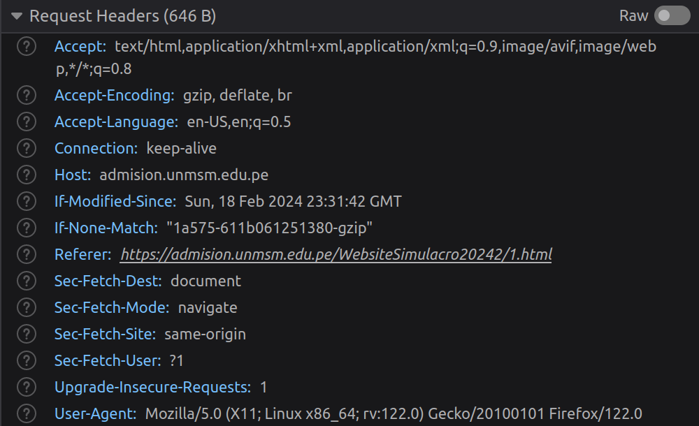
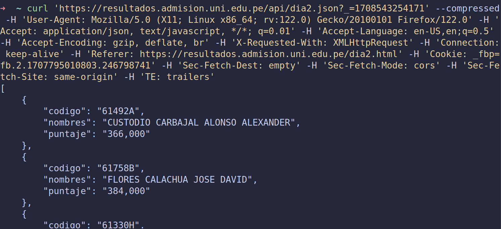
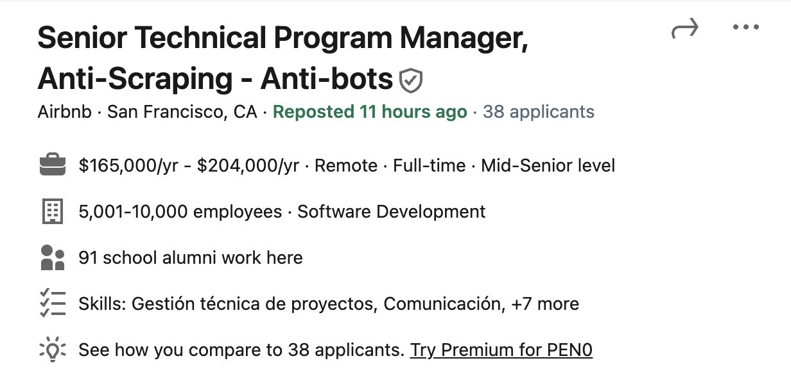
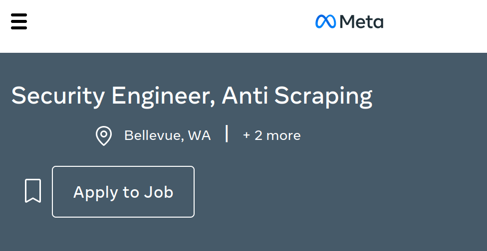

+++
title="Web Scrapping con python 101"
date=2024-02-21
+++

El arte del web scrapping es uno que todos en el mundo del software deberíamos conocer. Ya sea para crear un comparador de precios como [Compy](https://compy.pe/) o armar datasets para nuestro siguiente modelo de Machine Learning, el saber cómo obtener los datos que necesitamos de una web es una habilidad que no hace daño tener.

Entonces, ¿cómo puedo iniciarme en el oscuro arte del web scrapping?

# Tipos de Web Scrapping

Antes de empezar a robar información de páginas del gobierno, es útil saber qué tipos de escenarios nos podemos encontrar al momento de querer scrappear una web:

## 1. Páginas estáticas

Son aquellas en las que no se requiere interacción alguna para poder acceder a la información que deseamos. Basta con obtener el código html de la página y ya tendremos acceso a toda su información. En el mejor de los casos, la información que queremos está ordenada en una tabla o una lista ordenada, pero la mayoría de las veces tendremos que encontrar el patrón que sigue nuestra página de interés <em>(un div, dentro de otro div, dentro de otro div...)</em>

_[Resultados de un examen de admisión ordenados en una tabla](https://admision.unmsm.edu.pe/WebsiteSimulacro20242/1/202/0.html)_

## 2. Páginas dinámicas

Para acceder a la información que deseamos es necesario interactuar de cierta manera con la web que intentamos scrappear. Simular el click en botones o llenar formularios son algunas de los primeros retos que uno se podría encontrar al iniciarse en el web scrapping.

_[Formulario interactivo de latam para poder listar vuelos](https://www.latamairlines.com/pe/es)_

## 3. Páginas que requieren a un hechicero de mayor nivel

En ciertas ocasiones, no bastará solo con simular interacciones con nuestra web de interés presionando botones o llenado formularios. Realizar peticiones HTTP, enviar cookies de request a request o usar alguna librería para simular distintos user-agents son algunas de las acciones que tendremos que realizar para poder obtener los datos que necesitamos. Puede darse incluso el caso en el que en un inicio tengamos que interactuar con una web -iniciando sesión por ejemplo- para luego obtener datos estáticos _(comentarios en una red social, listado de seguidores, etc)_

```python
def robar_receta_cangreburger():
    url = 'https://api-totalmente-real/obtener-receta-cangreburger'
    bearer_token = f'Bearer {token}'
    headers = {
        'accept': 'application/json, text/plain, */*',
        'Accept-Encoding': 'gzip',
        'authorization': bearer_token,
        'Connection': 'Keep-Alive',
        'Host': 'don.cangrejo.com',
        'User-Agent': 'okhttp/4.9.2'
    }
    request = requests.get(url, headers=headers, cookies=cookies)
```

_Realizando una solicitud http usando un token de autenticación_

# ¿Qué herramientas usar ante cada situación?

Si bien podemos usar distintas librerías para cada situación, existen algunas que suelen ser más usadas y de las que podremos encontrar mayor cantidad de documentación o preguntas en el difunto stackoverflow

- ## Para páginas estáticas

### [Beautiful Soup](https://beautiful-soup-4.readthedocs.io/en/latest/)

- Es una librería que permite transformar archivos HTML en estructuras de datos tipo árbol, lo cual permite que sea sencillo navegar a través de los distintos elementos que una página pueda contener.
- Con esta librería podemos hacer cosas como obtener todos los enlaces que una página contiene, todos los div que tienen como clase _data-container_ o todos los **tr** dentro de una tabla.
- La belleza que tiene esta librería es que, al trabajar con arboles, brinda una gran flexibilidad para poder llegar a la información que requerimos. Quizás el _div_ que contiene toda la información que buscamos no tiene un id, class o algo similar que nos permita acceder directamente a él, pero si el primer elemento que tiene es un _h1_ con _id="page-tittle"_, haciendo uso de **.parent** podemos llegar a dicho div  
  _Del siguiente html:_

```html
<div>
  <h1 id="page-title">Listado de seres sensibles a la fuerza</h1>
  <div>
    <h3>Nombre:</h3>
    <h3>Planeta:</h3>
    <h3>Edad:</h3>
  </div>
</div>
```

_Podemos acceder al div de interés de la siguiente manera_

```python
    # Ubicamos el elemento que tiene como padre nuestro div de interés
    page_title = soup.find(id='page-title)
    # Accedemos al div de interés mediante su elemento hijo usando .parent
    content-container = page_tittle.parent

```

- ## Para páginas dinámicas

### [Selenium](https://beautiful-soup-4.readthedocs.io/en/latest/)

- Es una librería que permite simular interacciones humanas en un navegador web, como presionar botones o llenar campos de texto
- Permite localizar elementos a través de su id, name, class y, quizás lo más útil, XPath
  - XPath se puede entender como la dirección que tiene todo elemento dentro de un archivo HTML
- Muchas veces el elemento al que queremos acceder no cuenta con un id, class, name o algo similar que permita su fácil identificación. El tener la opción de poder ubicarlo mediante su Xpath nos permite poder acceder e interacturar con prácticamente cualquier elemento html que una web pueda contener  
  _Del siguiente html:_

```html
<html>
  <body>
    <form id="loginForm">
      <input name="username" type="text" />
      <input name="password" type="password" />
      <input name="continue" type="submit" value="Login" />
      <input name="continue" type="button" value="Clear" />
    </form>
  </body>
</html>
```

_Podemos ubicar el elemento form de usando Xpath de las siguientes maneras:_

```python
login_form = driver.find_element(By.XPATH, "/html/body/form[1]")
login_form = driver.find_element(By.XPATH, "//form[1]")
login_form = driver.find_element(By.XPATH, "//form[@id='loginForm']")
```

- ## Jutsus prohibidos
  Muchas veces es útil ver cómo es que la página que deseamos scrappear obtiene la información que muestra. Si bien hay casos en los que el servidor nos devuelve directamente un html de 20k lineas, lo más común es que exista un API encargado de entregar dicha información. Este [video](https://www.youtube.com/watch?v=DqtlR0y0suo&t=6s) lo explica bastante bien, pero muy a groso modo lo primero que uno debería hacer antes de empezar a scrappear una web es lo siguiente:
  1. Abrir las dev tools del navegador y ver qué peticiones se realizan en el apartado de Network al momento de cargar nuestra página de interés.
     
  2. Revisar las peticiones -de tipo html o javascript- en busca de la ruta al api que dicha web usa
  3. En caso de identificar el api que usa la web, ver los headers y payload que requiere para recibir peticiones
     
  4. Probar dicho api en **Postman** o alguna herramienta similar, como **Curl** o **Fetch**
     

La mayoría de las veces no será sencillo acceder al tan valioso api interno que usa una web. Un buen consejo sería revisar detalladamente todas las peticiones de tipo html o javascript que realiza una página. No son pocas las veces que revisando las secciones _script_ de un html pude descubrir cómo es que dicha web obtiene su información.

# Precauciones a tomar en cuenta


Si bien la acción de obtener datos de una web haciendo uso de web scrapping no es ilegal, lo que uno haga con dichos datos puede llegar a serlo. Obtener datos personales aprovechando los pocos o incluso nulos mecanismos de protección que suelen tener las páginas del estado es un ejemplo de ello. No son pocas también las compañías que ofrecen puestos de trabajo como anti scrapper.



# Conclusiones

Este post tiene como finalidad el brindar los primeros pasos para alguien que desea iniciarse en el mundo del web scrapping. En un futuro la idea es realizar otros posts mostrando cómo usar las librerías mencionadas, y dar algunos trucos y consejos que he podido aprender en los años que llevo scrappeando páginas para fines totalmente lícitos y académicos.
