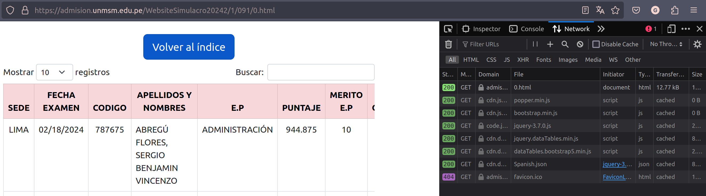

+++
title = "Web Scrapping con python 101"
date = 2024-02-19
+++

El arte del web scrapping es uno que todos en el mundo del software deberíamos conocer. Ya sea para crear un comparador de precios como [Compy](https://compy.pe/) o armar datasets para nuestro siguiente modelo de Machine Learning, el saber cómo obtener los datos que necesitamos de una web es una habilidad que no hace daño tener.

Entonces, ¿cómo puedo iniciarme en el oscuro arte del web scrapping?

## Tipos de Web Scrapping

Antes de empezar a robar información de páginas del gobierno, es útil saber qué tipos de escenarios nos podemos encontrar al momento de querer scrappear una web:

### 1. Páginas estáticas

Son aquellas en las que no se requiere interacción alguna para poder acceder a la información que deseamos. Basta con obtener el código html de la página y ya tendremos acceso a toda su información. En el mejor de los casos, la información que queremos está ordenada en una tabla o una lista ordenada, pero la mayoría de las veces tendremos que encontrar el patrón que sigue nuestra página de interés <em>(un div, dentro de otro div, dentro de otro div...)</em>

_[resultados de un examen de admisión ordenados en una tabla](https://admision.unmsm.edu.pe/WebsiteSimulacro20242/1/202/0.html)_

### 2. Páginas dinámicas

Para acceder a la información que deseamos es necesario interactuar de cierta manera con la web que intentamos scrappear. Presionar botones o llenar formularios son algunas de los primeros retos que uno se podría encontrar al iniciarse en el web scrapping.
